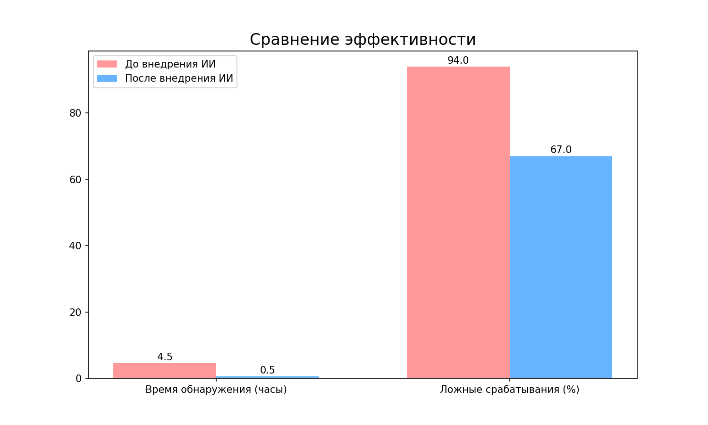

# Дипломная работа: Интеграция ИИ в систему информационной безопасности

Jupyter Notebook с анализом данных и обнаружением аномалий.

## Файлы
- `analysis_diploma.ipynb` — основной код и визуализация

## Запуск
```bash
pip install pandas matplotlib numpy
```
## 📊 Результаты внедрения

В таблице представлено сравнение эффективности работы системы информационной безопасности до и после внедрения разработанных методических рекомендаций (на основе данных из параграфа 3.3.2 дипломной работы).

| Показатель | До внедрения ИИ | После внедрения ИИ | Изменение |
|------------|-----------------|-------------------|-----------|
| **Количество инцидентов в месяц** | 47 | 52 | ▲ +10% |
| **Выявлено внутренних нарушителей** | 3 | 8 | ▲ +166% |
| **Среднее время обнаружения** | 4.5 часа | 0.5 часа | ▼ -89% |
| **Доля ложных срабатываний** | 94% | 67% | ▼ -27% |
| **Инциденты, выявленные только благодаря ИИ** | — | 6 | +6 |

## 📈 Визуализация результатов



## 📌 О работе

Данный репозиторий создан в рамках выполнения выпускной квалификационной работы на тему *"Разработка методических рекомендаций по интеграции технологий искусственного интеллекта в систему управления информационной безопасностью"* (МГЛУ, 2026).

Автор: Воробьева Евгения Александровна