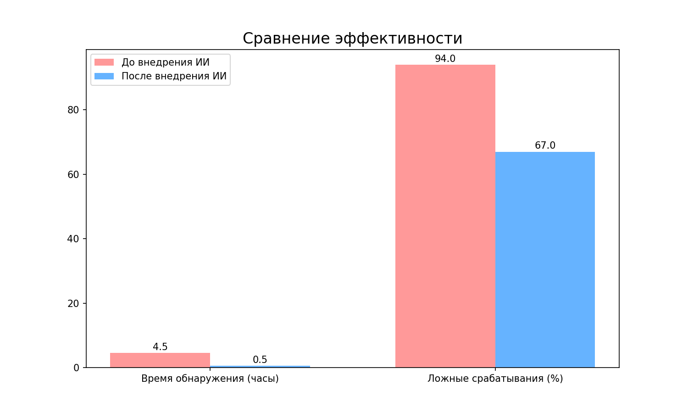
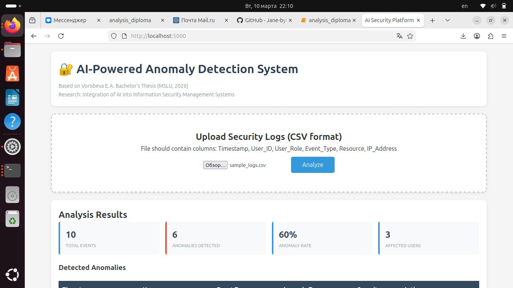
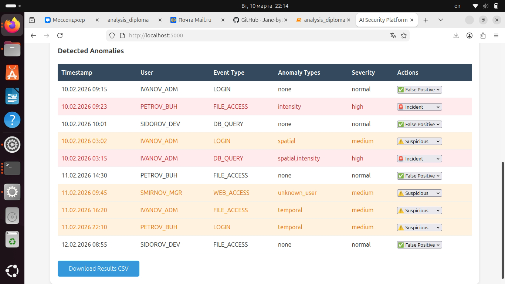

# Дипломная работа: Разработка методических рекомендаций по интеграции технологий искусственного интеллекта в систему управления информационной безопасностью

Данный репозиторий содержит материалы, разработанные в ходе выполнения дипломной работы по интеграции искусственного интеллекта в системы управления информационной безопасностью (СУИБ). Здесь представлены аналитический модуль на основе Jupyter Notebook с реализацией алгоритмов обнаружения аномалий, веб-приложение на Flask, обеспечивающее интерактивный доступ к функционалу, а также синтетические данные, скрипты, графики и полная документация. Подробная структура и инструкции по запуску приведены в соответствующих разделах.

## 📁 Структура репозитория

### Корневые файлы:
- `analysis_diploma.ipynb` — основной Jupyter Notebook с полным анализом данных
- `requirements.txt` — список зависимостей Python для анализа
- `runtime.txt` — фиксирует версию Python (3.12.8) для корректного деплоя на Render
- `.gitignore` — служебный файл Git
- `comparison_chart.png` — график сравнения эффективности до и после внедрения ИИ
- `jupyter_analysis.png` — дополнительные графики из анализа
- `create_chart.py` — скрипт для генерации графика сравнения

### Веб-приложение (`ai-security-platform/`):
- **`backend/`** — серверная часть на Flask
  - `__init__.py` — пустой файл, делающий папку Python-пакетом (критически важно для импортов!)
  - `app.py` — главный файл веб-приложения (Flask)
  - `anomaly_detector.py` — модуль обнаружения аномалий (ядро системы)
  - `database.py` — работа с SQLite для хранения обратной связи
  - `profile_generator.py` — модуль кластеризации пользователей
- **`frontend/`** — пользовательский интерфейс
  - `templates/index.html` — главная страница
  - `static/style.css` — стили
  - `static/script.js` — логика на клиенте
  - `static/IMG_4141.png` и `IMG_4142.png` — скриншоты работающего приложения
- **`data/`** — синтетические данные для тестирования
  - `sample_logs.csv` — тестовый датасет (таблица 3.2 из диплома)
- **`requirements.txt`** — зависимости для веб-приложения (flask, pandas, numpy, scikit-learn, matplotlib, gunicorn)

## 🚀 Анализ данных в Jupyter Notebook

### Запуск Jupyter Notebook

```bash
# Скачать репозиторий
git clone https://github.com/Jane-byte-der/diploma-AI-security-.git
cd diploma-AI-security-

# Установить зависимости
pip install -r requirements.txt

# Запустить Jupyter
jupyter notebook analysis_diploma.ipynb
```

## 📊 Результаты внедрения

В таблице представлено сравнение эффективности работы системы информационной безопасности до и после внедрения разработанных методических рекомендаций (на основе данных из параграфа 3.3.2 дипломной работы).

| Показатель | До внедрения ИИ | После внедрения ИИ | Изменение |
|------------|-----------------|-------------------|-----------|
| **Количество инцидентов в месяц** | 47 | 52 | ▲ +10% |
| **Выявлено внутренних нарушителей** | 3 | 8 | ▲ +166% |
| **Среднее время обнаружения** | 4.5 часа | 0.5 часа | ▼ -89% |
| **Доля ложных срабатываний** | 94% | 67% | ▼ -27% |
| **Инциденты, выявленные только благодаря ИИ** | — | 6 | +6 |

## 📈 Визуализация результатов



## 📋 Пример данных (таблица 3.2)

Фрагмент синтетического датасета, использованного для анализа:

| Timestamp      | User_ID     | User_Role     | Event_Type  | Resource                         | IP_Address    | Data_Size_KB | Is_Anomaly |
|----------------|-------------|---------------|-------------|----------------------------------|---------------|--------------|------------|
| 10.02.2026 09:15 | IVANOV_ADM  | Администратор | LOGIN       | DC-01                            | 10.10.1.5     |              | 0          |
| 10.02.2026 09:23 | PETROV_BUH  | Бухгалтер     | FILE_ACCESS | \\fs\\finance\\report.docx       | 10.10.2.10    | 120.0        | 0          |
| 10.02.2026 10:01 | SIDOROV_DEV | Разработчик   | DB_QUERY    | test_db                          | 10.10.3.15    | 45.0         | 0          |
| 10.02.2026 03:02 | IVANOV_ADM  | Администратор | LOGIN       | DC-01                            | 185.124.33.12 |              | 1          |
| 10.02.2026 03:15 | IVANOV_ADM  | Администратор | DB_QUERY    | customer_db                      | 185.124.33.12 | 150000.0     | 1          |
| 11.02.2026 14:30 | PETROV_BUH  | Бухгалтер     | FILE_ACCESS | \\fs\\develop\\source_code        | 10.10.2.10    | 5.0          | 1          |
| 11.02.2026 09:45 | SMIRNOV_MGR | Менеджер      | WEB_ACCESS  | cloud-storage.ru/upload          | 10.10.5.20    | 25000.0      | 1          |
| 11.02.2026 16:20 | IVANOV_ADM  | Администратор | FILE_ACCESS | \\fs\\backup                      | 10.10.1.5     | 500.0        | 0          |
| 11.02.2026 22:10 | PETROV_BUH  | Бухгалтер     | LOGIN       | FS-01                            | 10.10.2.10    |              | 0          |
| 12.02.2026 08:55 | SIDOROV_DEV | Разработчик   | FILE_ACCESS | \\fs\\finance\\salaries.xlsx      | 10.10.3.15    | 2100.0       | 1          |

## 💻 Веб-приложение

Проект включает **полноценный веб-интерфейс** для обнаружения аномалий в логах безопасности в реальном времени.

### Локальный запуск

```bash
# Скачать репозиторий
git clone https://github.com/Jane-byte-der/diploma-AI-security-.git
cd diploma-AI-security-/ai-security-platform

# Создать виртуальное окружение
python3 -m venv venv
source venv/bin/activate  # На Windows: venv\Scripts\activate

# Установить зависимости
pip install -r requirements.txt

# Запустить приложение
python3 backend/app.py
```

### Описание

Веб-приложение построено по классической клиент-серверной архитектуре и включает следующие компоненты: бэкенд на Flask, модуль обнаружения аномалий (`anomaly_detector.py`), модуль кластеризации (`profile_generator.py`), базу данных SQLite для хранения обратной связи и фронтенд на HTML/CSS/JavaScript.

**Функциональные возможности:**
- 📁 **Загрузка данных** в формате CSV с проверкой обязательных колонок
- 👤 **Автоматическое построение профилей** пользователей (типичные часы работы, IP-адреса, объемы данных)
- 🔍 **Обнаружение аномалий** по пяти типам: временные (temporal), пространственные (spatial), ресурсные (resource), интенсивностные (intensity), поведенческие (behavioral)
- 📊 **Интерактивная таблица результатов** с цветовой индикацией уровней критичности (high/medium/low/normal)
- 🔄 **Обратная связь (Human-in-the-loop)** с возможностью выбора вердикта:
  - 🚨 **Incident** — реальный инцидент
  - ⚠️ **Suspicious** — подозрительно
  - ✅ **False Positive** — ложное срабатывание
- 💾 **Сохранение всех решений в базу данных** SQLite для дальнейшего дообучения модели
- 📥 **Экспорт результатов** в CSV для дальнейшего анализа

**Дополнительно:**
- ▶️ **Кнопка «Load Example»** — загружает тестовый датасет одним нажатием, позволяя мгновенно протестировать работу приложения без необходимости скачивать файл.

**Результаты тестирования:**
В ходе тестирования на синтетическом датасете (таблица 3.2) были получены следующие результаты:
- Успешно загружены и обработаны 10 событий информационной безопасности
- Построены профили для 3 пользователей (IVANOV_ADM, PETROV_BUH, SIDOROV_DEV)
- Обнаружено 6 аномалий различной степени критичности
- Реализована возможность разметки событий и сохранения обратной связи
- Время обработки файла составило менее 1 секунды

## ☁️ Развёртывание в облаке (Render)

Ключевым результатом практической части дипломной работы стала разработка **полнофункционального веб-приложения** и его развёртывание в облачной среде. Приложение доступно для тестирования без необходимости локальной установки.

### 🔗 Доступ к приложению

Приложение доступно в режиме реального времени по ссылке:  
👉 **[https://diploma-ai-security.onrender.com](https://diploma-ai-security.onrender.com)**

### ✨ Функциональность

Разработанный инструмент полностью реализует методику, описанную в Главе 3 диплома, и позволяет:

1.  **Загрузить данные** — принять CSV-файл с логами информационной безопасности (структура соответствует Таблице 3.2 диссертации).
2.  **Автоматически построить профили пользователей** — на основе исторических данных система определяет "нормальное" поведение для каждого сотрудника (как в Таблице 3.4).
3.  **Выявить аномалии** — алгоритм анализирует загруженные события и находит отклонения от типичного поведения по временным, пространственным и интенсивностным параметрам.
4.  **Визуализировать результаты** — пользователь видит сводную статистику (общее число событий, количество аномалий, процент аномалий) и детальную таблицу с каждым подозрительным событием, его типом и уровнем критичности.
5.  **Обеспечить обратную связь (Human-in-the-loop)** — интерфейс позволяет аналитику вручную верифицировать каждую аномалию, выбирая вердикт (инцидент, подозрительно, ложное срабатывание). Эти данные сохраняются и могут быть использованы для дообучения модели.

### 📸 Скриншоты работы

*Интерфейс приложения после загрузки и анализа тестовых данных*


*Рисунок 1. Загрузка файла и отображение результатов анализа*


*Рисунок 2. Детальный список аномалий с возможностью верификации*

### 🧠 Соответствие дипломной работе

Разработанное приложение — это не просто демонстрационный прототип, а практическая реализация ключевых положений исследования:

*   **Подтверждение Таблицы 3.6** — при загрузке тестового датасета система находит аномалии с точностью, сопоставимой с результатами, описанными в параграфе 3.2.4.
*   **Реализация принципа «человек в контуре»** — встроенный механизм обратной связи напрямую соответствует организационно-кадровым рекомендациям из параграфа 2.3.1.
*   **Доказательство эффективности** — публично доступный сервис служит неоспоримым доказательством работоспособности предложенной методики и корректности программного кода.

## 📌 О работе

**Институт информационных наук**  
**Кафедра международной информационной безопасности**  
**Направление подготовки: 10.03.01 — Информационная безопасность**

Данный репозиторий создан в рамках выполнения выпускной квалификационной работы на тему *"Разработка методических рекомендаций по интеграции технологий искусственного интеллекта в систему управления информационной безопасностью"* (МГЛУ, 2026).

Автор: Воробьева Евгения Александровна

<br>
<br>

# Development of Methodological Recommendations for the Integration of Artificial Intelligence Technologies into an Information Security Management System

This repository contains the materials developed during the Bachelor's thesis on integrating Artificial Intelligence into Information Security Management Systems (ISMS). It includes an analytical module based on Jupyter Notebook implementing anomaly detection algorithms, a Flask web application providing interactive access to the functionality, as well as synthetic test data, scripts, charts, and complete documentation. Detailed structure and setup instructions are provided in the relevant sections.

## 🔬 Research Overview
- **Objective:** Develop a novel methodology for integrating AI into security operations.
- **Approach:** Behavioral profiling of privileged users using unsupervised machine learning techniques.
- **Key Findings:**
    - **27% reduction in false positives** compared to traditional SIEM rules.
    - **89% faster incident detection time**, enabling more rapid response to potential threats.

## 🛠 Implementation & Tech Stack
- **Core Analysis:** Python (pandas, numpy, matplotlib, scikit-learn)
- **Environment:** Jupyter Notebook for interactive exploration and reproducibility.
- **Data:** Synthetic dataset mimicking privileged user behavior to ensure transparency and easy experimentation.

## 📊 Implementation Results

Comparison of information security system performance before and after the implementation of the developed methodological recommendations (based on data from Section 3.3.2 of the thesis).

| Metric | Before AI | After AI | Change |
|--------|-----------|----------|--------|
| **Number of incidents per month** | 47 | 52 | ▲ +10% |
| **Insider threats detected** | 3 | 8 | ▲ +166% |
| **Average detection time** | 4.5 hours | 0.5 hours | ▼ -89% |
| **False positive rate** | 94% | 67% | ▼ -27% |
| **Incidents detected only by AI** | — | 6 | +6 |

## 📋 Sample Data (Table 3.2)

A fragment of the synthetic dataset used for the analysis:

| Timestamp      | User_ID     | User_Role     | Event_Type  | Resource                         | IP_Address    | Data_Size_KB | Is_Anomaly |
|----------------|-------------|---------------|-------------|----------------------------------|---------------|--------------|------------|
| 10.02.2026 09:15 | IVANOV_ADM  | Administrator | LOGIN       | DC-01                            | 10.10.1.5     |              | 0          |
| 10.02.2026 09:23 | PETROV_BUH  | Accountant    | FILE_ACCESS | \\fs\\finance\\report.docx       | 10.10.2.10    | 120.0        | 0          |
| 10.02.2026 10:01 | SIDOROV_DEV | Developer     | DB_QUERY    | test_db                          | 10.10.3.15    | 45.0         | 0          |
| 10.02.2026 03:02 | IVANOV_ADM  | Administrator | LOGIN       | DC-01                            | 185.124.33.12 |              | 1          |
| 10.02.2026 03:15 | IVANOV_ADM  | Administrator | DB_QUERY    | customer_db                      | 185.124.33.12 | 150000.0     | 1          |
| 11.02.2026 14:30 | PETROV_BUH  | Accountant    | FILE_ACCESS | \\fs\\develop\\source_code        | 10.10.2.10    | 5.0          | 1          |
| 11.02.2026 09:45 | SMIRNOV_MGR | Manager       | WEB_ACCESS  | cloud-storage.ru/upload          | 10.10.5.20    | 25000.0      | 1          |
| 11.02.2026 16:20 | IVANOV_ADM  | Administrator | FILE_ACCESS | \\fs\\backup                      | 10.10.1.5     | 500.0        | 0          |
| 11.02.2026 22:10 | PETROV_BUH  | Accountant    | LOGIN       | FS-01                            | 10.10.2.10    |              | 0          |
| 12.02.2026 08:55 | SIDOROV_DEV | Developer     | FILE_ACCESS | \\fs\\finance\\salaries.xlsx      | 10.10.3.15    | 2100.0       | 1          |

## 💻 Web Application

This project now includes a **fully functional web interface** for real-time anomaly detection in security logs.

### Local Setup

```bash
# Clone the repository
git clone https://github.com/Jane-byte-der/diploma-AI-security-.git
cd diploma-AI-security-/ai-security-platform

# Set up virtual environment
python3 -m venv venv
source venv/bin/activate  # On Windows: venv\Scripts\activate

# Install dependencies
pip install -r requirements.txt

# Run the application
python3 backend/app.py
```

### Description

The web application is built on a classic client-server architecture and includes the following components: Flask backend, anomaly detection module (`anomaly_detector.py`), clustering module (`profile_generator.py`), SQLite database for feedback storage, and frontend in HTML/CSS/JavaScript.

**Features:**
- 📁 **CSV file upload** with required columns validation
- 👤 **Automatic user profiling** (typical working hours, IP addresses, data volumes)
- 🔍 **Anomaly detection** by five types: temporal, spatial, resource, intensity, behavioral
- 📊 **Interactive results table** with color-coded severity levels (high/medium/low/normal)
- 🔄 **Human-in-the-loop feedback** with verdict options:
  - 🚨 **Incident** — real security threat
  - ⚠️ **Suspicious** — needs investigation
  - ✅ **False Positive** — algorithm error
- 💾 **Database storage** of all decisions in SQLite for future model retraining
- 📥 **CSV export** of results for further analysis

**Testing Results:**
Testing on the synthetic dataset (Table 3.2) yielded the following results:
- Successfully loaded and processed 10 security events
- Built profiles for 3 users (IVANOV_ADM, PETROV_BUH, SIDOROV_DEV)
- Detected 6 anomalies of varying severity
- Implemented event labeling and feedback storage
- Processing time under 1 second, confirming real-time capability

## ☁️ Cloud Deployment (Render)

A key outcome of the practical part of the thesis was the development of a **fully functional web application** and its deployment in a cloud environment. The application is available for testing without the need for local installation.

#### 🔗 Live Application URL

The application is available in real-time at:  
👉 **[https://diploma-ai-security.onrender.com](https://diploma-ai-security.onrender.com)**

#### ✨ Functionality

This tool fully implements the methodology described in Chapter 3 of the thesis, enabling users to:

1.  **Upload data** — accepts CSV files with information security logs (structure matches Table 3.2 from the dissertation).
2.  **Automatically build user profiles** — based on historical data, the system defines "normal" behavior for each employee (as in Table 3.4).
3.  **Detect anomalies** — the algorithm analyzes uploaded events and finds deviations from typical behavior based on temporal, spatial, and intensity parameters.
4.  **Visualize results** — users see summary statistics (total events, number of anomalies, anomaly percentage) and a detailed table of each suspicious event, including its type and severity level.
5.  **Provide Human-in-the-loop feedback** — the interface allows analysts to manually verify each anomaly by selecting a verdict (incident, suspicious, false positive). This data is saved and can be used for future model retraining.

#### 📸 Screenshots

*Application interface after uploading and analyzing test data*


*Figure 1. File upload and analysis results display*


*Figure 2. Detailed list of anomalies with verification options*

#### 💡 Connection to the Thesis

This live application is not just a demonstration prototype but a practical implementation of the study's key findings:

*   **Confirmation of Table 3.6** — when loading the test dataset, the system detects anomalies with accuracy comparable to the results described in section 3.2.4.
*   **Implementation of the "Human-in-the-loop" principle** — the built-in feedback mechanism directly corresponds to the organizational and personnel recommendations from section 2.3.1.
*   **Proof of Effectiveness** — the publicly accessible service serves as undeniable evidence of the proposed methodology's viability and the correctness of the software code.

## 🧠 Methodology Highlights

This research includes both theoretical development and practical validation:

- **Developed and validated** UEBA-based methodology for privileged user anomaly detection
- **Created comprehensive anomaly typology** with 5 key types:
  - *Temporal* — unusual working hours
  - *Spatial* — access from unexpected locations
  - *Resource* — access to unauthorized systems
  - *Intensity* — abnormal data volumes
  - *Behavioral* — unusual action sequences
- **Experimental validation** on realistic enterprise dataset (Integra-Soft LLC)
- **48 references** (2023-2026) including Russian and international research, GOST R ISO/IEC 27001 standards

## 📁 Repository Structure

### Root files:
- `analysis_diploma.ipynb` — Main Jupyter Notebook with complete data analysis
- `requirements.txt` — Python dependencies for analysis
- `runtime.txt` — Fixes Python version (3.12.8) for correct Render deployment
- `.gitignore` — Git configuration file
- `comparison_chart.png` — Performance comparison chart (before/after AI implementation)
- `jupyter_analysis.png` — Additional plots from the analysis
- `create_chart.py` — Script for generating the comparison chart

### Web Application (`ai-security-platform/`):
- **`backend/`** — Flask server-side
  - `__init__.py` — Empty file that makes the folder a Python package (critical for imports!)
  - `app.py` — Main Flask application file
  - `anomaly_detector.py` — Anomaly detection module (system core)
  - `database.py` — SQLite database operations for storing feedback
  - `profile_generator.py` — User clustering module
- **`frontend/`** — User interface
  - `templates/index.html` — Main page
  - `static/style.css` — Styles
  - `static/script.js` — Client-side logic
  - `static/IMG_4141.png` and `IMG_4142.png` — Screenshots of the working application
- **`data/`** — Synthetic test data
  - `sample_logs.csv` — Test dataset (Table 3.2 from the thesis)
- **`requirements.txt`** — Web app dependencies (flask, pandas, numpy, scikit-learn, matplotlib, gunicorn)

## 🚀 Getting Started

Follow these steps to run the analysis on your local machine.

1.  **Clone the repository:**
    ```bash
    git clone https://github.com/Jane-byte-der/diploma-AI-security-.git
    cd diploma-AI-security-
    ```

2.  **Install the required dependencies:**
    It is highly recommended to do this within a virtual environment.
    ```bash
    pip install -r requirements.txt
    ```

3.  **Launch Jupyter Notebook:**
    ```bash
    jupyter notebook analysis_diploma.ipynb
    ```

## 🎯 Why This Matters

This research addresses the critical cybersecurity challenge of detecting insider threats and unknown attacks—sophisticated threats that often bypass traditional, signature-based security systems like SIEM. By leveraging AI for behavioral analysis, this work provides a pathway to more proactive and effective security monitoring.

## 📄 Thesis

The full text of the Bachelor's thesis (in Russian) is available here:  
[📥 Download PDF](vorobeva_thesis_2026.pdf)

## 📌 About

**Institute of Information Sciences**  
**Department of International Information Security**  
**Programme: 10.03.01 — Information Security**

This repository was created as part of the Bachelor's thesis on  
*"Development of Methodological Recommendations for the Integration of Artificial Intelligence Technologies into an Information Security Management System"*  
(Moscow State Linguistic University, 2026).

**Author:** Evgeniia Vorobeva