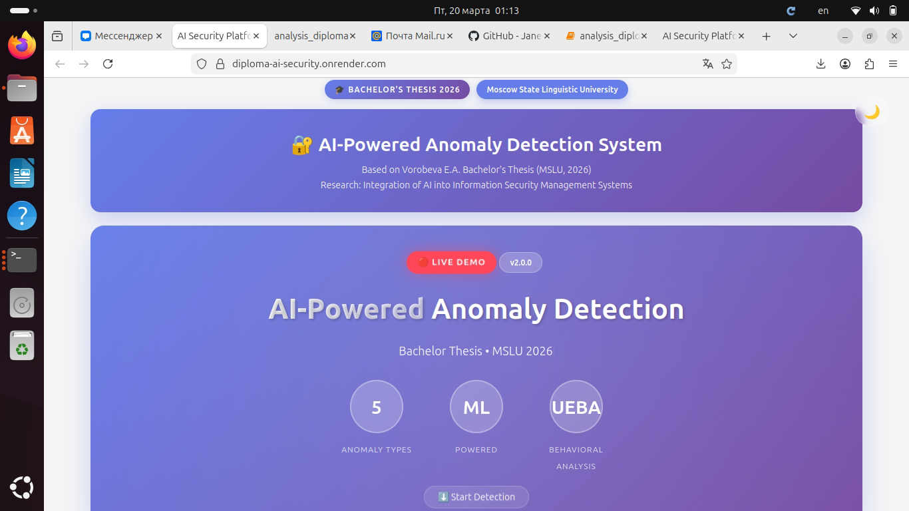
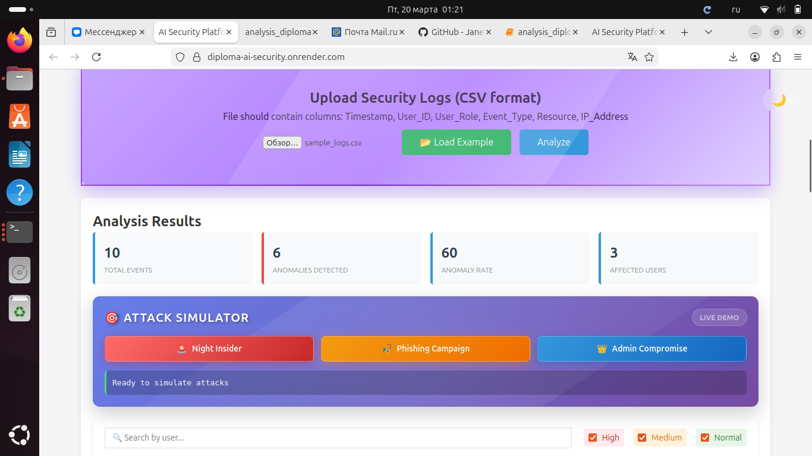
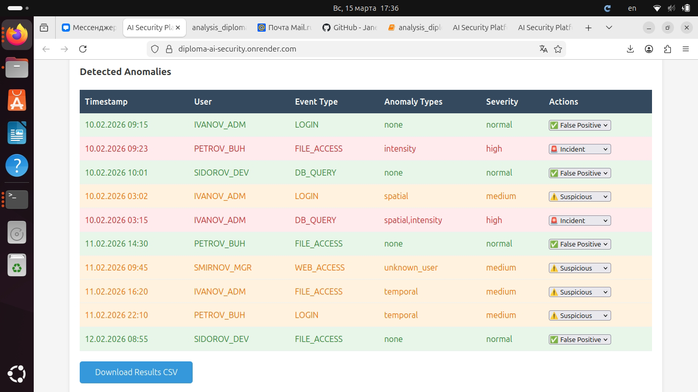
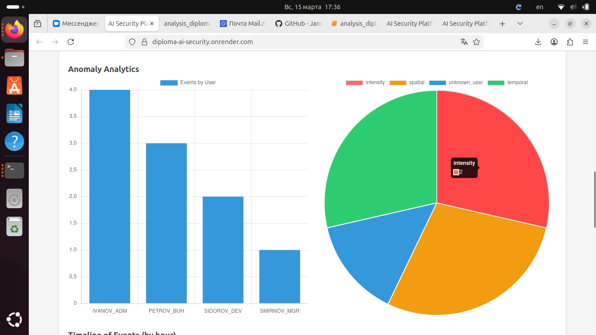
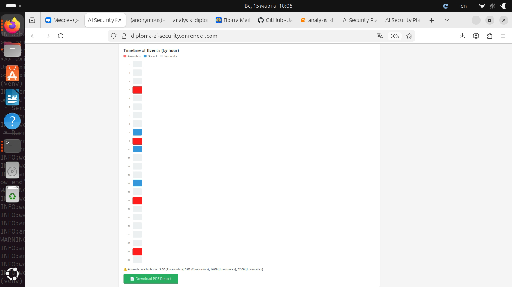
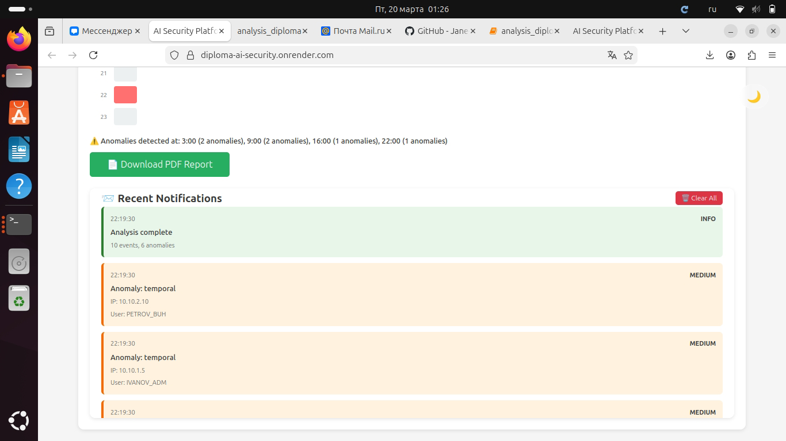
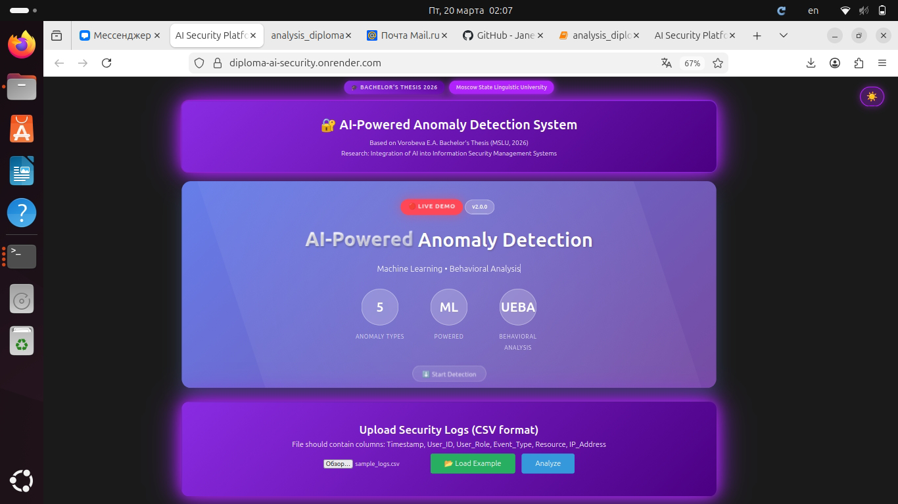
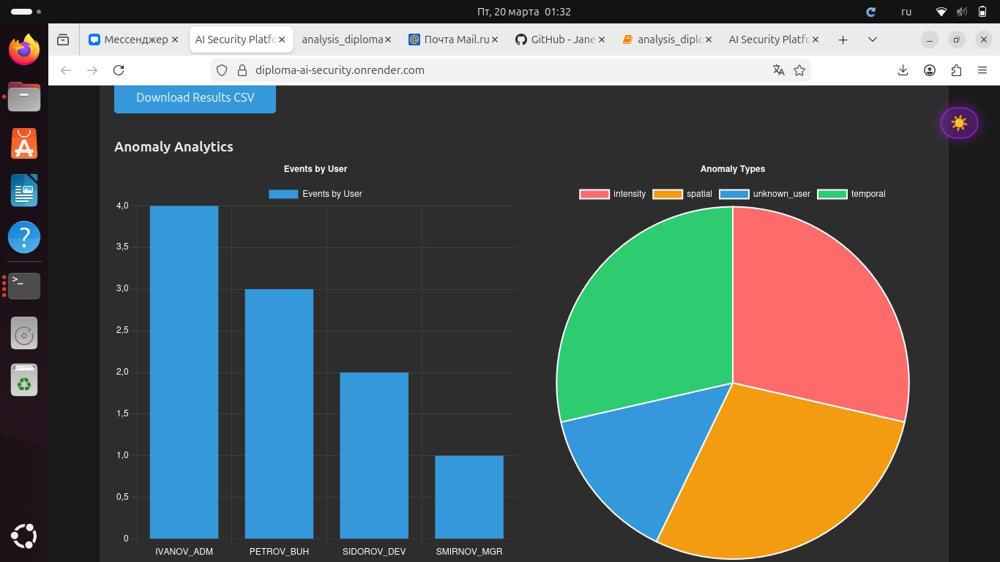

# 🧠 AI Security Anomaly Detection Platform

> Trilingual Documentation / 三语文档 / Трёхъязычная документация:  
> 🇨🇳 中文 · 🇷🇺 Русский · 🇬🇧 English

<br>
<br>

---
---

## Навигация / Navigation / 导航

- 🇨🇳 [中文文档](#-中文文档)
- 🇷🇺 [Русская версия](#-русская-версия)
- 🇬🇧 [English Version](#-english-version)

---
---

<br>
  
## 🇨🇳 中文文档 (Chinese Documentation)

# 🧠 制定将人工智能技术融入信息安全管理系统的方法建议

本仓库包含在毕业论文研究过程中开发的全部材料，旨在探索人工智能技术在信息安全管理体系（ISMS）中的整合方法。

---

## 📦 项目结构

### Web应用程序 (`ai-security-platform/`):
- **`backend/`** — 基于 Flask 的后端服务
  - `__init__.py` — 将文件夹标记为 Python 包（对导入至关重要）
  - `app.py` — Web应用程序主文件 (Flask)
  - `anomaly_detector.py` — 异常检测模块（系统核心）
  - `database.py` — 使用 SQLite 存储反馈数据
  - `profile_generator.py` — 用户聚类模块
- **`frontend/`** — 用户界面
  - `templates/index.html` — 主页面
  - `static/style.css` — 样式文件
  - `static/script.js` — 客户端逻辑
- **`data/`** — 用于测试的合成数据
  - `sample_logs.csv` — 测试数据集（论文中的表3.2）
- **`requirements.txt`** — Web应用程序依赖项 (flask, pandas, numpy, scikit-learn, matplotlib, gunicorn)

---

## 📊 示例数据（表3.2）

用于分析的合成数据集片段：

| Timestamp      | User_ID     | User_Role     | Event_Type  | Resource                         | IP_Address    | Data_Size_KB | Is_Anomaly |
|----------------|-------------|---------------|-------------|----------------------------------|---------------|--------------|------------|
| 10.02.2026 09:15 | IVANOV_ADM  | 管理员 | LOGIN       | DC-01                            | 10.10.1.5     |              | 0          |
| 10.02.2026 09:23 | PETROV_BUH  | 会计 | FILE_ACCESS | \\fs\\finance\\report.docx       | 10.10.2.10    | 120.0        | 0          |
| 10.02.2026 10:01 | SIDOROV_DEV | 开发人员 | DB_QUERY    | test_db                          | 10.10.3.15    | 45.0         | 0          |
| 10.02.2026 03:02 | IVANOV_ADM  | 管理员 | LOGIN       | DC-01                            | 185.124.33.12 |              | **1**          |
| 10.02.2026 03:15 | IVANOV_ADM  | 管理员 | DB_QUERY    | customer_db                      | 185.124.33.12 | 150000.0     | **1**          |
| 11.02.2026 14:30 | PETROV_BUH  | 会计 | FILE_ACCESS | \\fs\\develop\\source_code        | 10.10.2.10    | 5.0          | **1**          |
| 11.02.2026 09:45 | SMIRNOV_MGR | 经理 | WEB_ACCESS  | cloud-storage.ru/upload          | 10.10.5.20    | 25000.0      | **1**          |
| 11.02.2026 16:20 | IVANOV_ADM  | 管理员 | FILE_ACCESS | \\fs\\backup                      | 10.10.1.5     | 500.0        | 0          |
| 11.02.2026 22:10 | PETROV_BUH  | 会计 | LOGIN       | FS-01                            | 10.10.2.10    |              | 0          |
| 12.02.2026 08:55 | SIDOROV_DEV | 开发人员 | FILE_ACCESS | \\fs\\finance\\salaries.xlsx      | 10.10.3.15    | 2100.0       | **1**          |

---

### ✅ 在测试数据集上的验证

为了验证算法的正确性，我们在合成数据集（表3.2）上进行了测试：
- **加载并处理了 10 条事件**
- **为 3 个用户** (IVANOV_ADM, PETROV_BUH, SIDOROV_DEV) 建立了行为画像
- **检测到 6 个异常**（与论文表3.6的数据相符）
- **处理时间小于 1 秒**，证明了实时处理能力

---

## 💻 Web应用程序

本项目现包含一个**完整的Web界面**，用于实时检测安全日志中的异常。

### 🚀 本地启动

```bash
# 克隆仓库
git clone https://github.com/Jane-byte-der/diploma-AI-security-.git
cd diploma-AI-security-/ai-security-platform

# 创建虚拟环境
python3 -m venv venv
source venv/bin/activate  # Windows系统: venv\Scripts\activate

# 安装依赖
pip install -r requirements.txt

# 启动应用程序
python3 backend/app.py
```

---

### ⚡ 功能描述

Web应用程序采用经典的客户端-服务器架构，包含以下组件：Flask后端、异常检测模块（`anomaly_detector.py`）、聚类模块（`profile_generator.py`）、用于存储反馈的SQLite数据库，以及基于HTML/CSS/JavaScript的前端。

**功能特性：**

- 📁 **上传CSV数据**，并自动验证必填列
- 👤 **自动构建用户画像**（典型工作时间、IP地址、数据量）
- 🔍 **五种类型的异常检测**：时间（temporal）、空间（spatial）、资源（resource）、强度（intensity）、行为（behavioral）
- 📊 **交互式结果表格**，具有颜色编码的严重性等级（高、中、低、正常）
- 🔄 **人在回路（Human-in-the-loop）反馈机制**，支持三种判决：
  - 🚨 **安全事件（Incident）**
  - ⚠️ **可疑（Suspicious）**
  - ✅ **误报（False Positive）**
- 💾 **将所有反馈存入SQLite数据库**，用于后续模型微调
- 📥 **导出结果为CSV格式**，便于进一步分析

---

### 🧩 表格交互功能

- 🔎 **按用户搜索** — 输入框实时过滤表格行
- 🔽 **严重性过滤器** — 选择要显示的级别（高、中、正常）
- ⚡ **组合过滤** — 搜索和严重性过滤器协同工作，精确筛选结果

---

### ✨ 附加功能

- ▶️ **加载示例（Load Example）按钮** — 一键加载测试数据集，无需下载文件即可立即测试应用程序功能。

---

### 🌈 事件可视化

**分析图表：**
- 📊 **柱状图** — 按用户分布的事件，悬停显示精确数值
- 🥧 **饼图** — 检测到的异常类型（时间、空间、强度等），悬停显示详细信息
- 📈 图表在每次分析后自动生成，实时更新并支持交互式探索

**时间线：**
- 📊 **交互式时间线** — 每小时显示为一个独立的彩色区块
- 🎨 **颜色编码**：
  - 🔴 **红色** — 异常活动
  - 🔵 **蓝色** — 正常操作
  - ⚪ **灰色** — 无事件记录
- ⚡ **动态高亮** — 异常集中的小时区块带有脉动动画
- 📋 **自动摘要** — 时间线下方列出检测到异常的小时列表

---

### 📄 报告导出

- 📄 **PDF报告** — 生成包含统计信息和异常表格的文档（前50条记录）
- 🎨 内置行颜色编码：
  - 🔴 **红色** — 高严重性
  - 🟡 **黄色** — 中严重性
  - 🟢 **绿色** — 正常
- 点击 **「📄 Download PDF Report」** 按钮一键下载报告

---

### 📨 事件监控

- 📨 **通知面板** — 实时显示最近的系统事件
  - 🔴 **红色**通知 — 严重异常
  - 🟡 **黄色**通知 — 可疑活动
  - 🟢 **绿色**通知 — 信息类消息
- 通知每 **5 秒** 自动更新一次
- 面板最多显示最近 **50 条** 事件，包含时间戳、严重等级和详细信息

---

### 🔥 攻击模拟器

用于建模各种攻击场景的交互面板：

- 🚨 **内部夜间攻击（Night Insider）** — 添加 3 条异常，涉及大量数据访问（用户：IVANOV_ADM）
- 🎣 **钓鱼攻击（Phishing Campaign）** — 添加 3 条异常，涉及可疑 Web 访问（用户：PETROV_BUH）
- 👑 **管理员失陷（Admin Compromise）** — 添加 3 条异常，涉及异常登录和批量查询（用户：SIDOROV_DEV）

> 💡 每次点击模拟器按钮，系统都会**实时更新所有组件**。

---

### 🔄 动态更新

每次点击模拟器按钮，以下组件自动更新：
- 📊 **统计数据**（总事件数、异常数量、异常比例、受影响用户）
- 📋 **表格**（添加新行，包含完整数据：用户角色、IP类型、资源）
- 📈 **图表**（柱状图和饼图使用更新后的数据重新绘制）
- 📉 **时间线**（出现新的彩色区块）
- 📨 **通知**（面板中出现新记录）

---

### 🗑️ 清空通知

- 通知面板中添加了 **「Clear All」** 按钮
- 一键删除数据库中的所有记录
- 系统在删除前会要求确认

---

### ⚖️ 自动数据库管理

- 数据库仅保留最新的 **100 条** 通知
- 添加新记录时自动删除旧记录
- 这可以防止数据库无限增长并优化性能

---

### ⏱️ 高精度时间戳

- 所有事件以**毫秒精度**保存
- 即使在快速连续攻击期间也能确保正确的排序

---

## ☁️ 云端部署 (Render)

毕业论文实践部分的一个关键成果是开发了**一个全功能的Web应用程序**并将其部署在云环境中。该应用程序无需本地安装即可进行测试。

### 🔗 在线访问地址

该应用程序支持实时访问：  
👉 **[https://diploma-ai-security.onrender.com](https://diploma-ai-security.onrender.com)**

---

### 🖼️ 应用程序界面

上传并分析测试数据后的应用程序界面：

  
**图1 — 应用程序主界面**

  
**图2 — 工作区及统计面板和攻击模拟器**

  
**图3 — 详细异常列表及验证选项**

  
**图4 — 分析图表（柱状图和饼图）**

  
**图5 — 按小时粒度及颜色编码的交互式时间线**

  
**图6 — 带颜色编码事件的通知面板**

  
**图7 — 暗色模式下的应用程序界面**

  
**图8 — 暗色模式下的分析图表**

---

## 📁 仓库结构

### 根目录文件：
- `analysis_diploma.ipynb` — 完整数据分析的主Jupyter Notebook
- `requirements.txt` — 数据分析的Python依赖项
- `runtime.txt` — 固定Python版本（3.12.8），确保Render正确部署
- `.gitignore` — Git配置文件
- `comparison_chart.png` — 性能对比图（AI实施前后）
- `jupyter_analysis.png` — 分析中的附加图表
- `create_chart.py` — 用于生成对比图表的脚本

### Web应用程序 (`ai-security-platform/`):
- **`backend/`** — Flask服务端
  - `__init__.py` — 将文件夹标记为Python包（对导入至关重要）
  - `app.py` — Flask主应用程序文件
  - `anomaly_detector.py` — 异常检测模块（系统核心）
  - `database.py` — SQLite数据库操作，用于存储反馈
  - `profile_generator.py` — 用户聚类模块
- **`frontend/`** — 用户界面
  - `templates/index.html` — 主页面
  - `static/style.css` — 样式文件
  - `static/script.js` — 客户端逻辑
- **`data/`** — 合成测试数据
  - `sample_logs.csv` — 测试数据集（论文中的表3.2）
- **`requirements.txt`** — Web应用程序依赖项 (flask, pandas, numpy, scikit-learn, matplotlib, gunicorn)

---

## 📌 关于本论文

**信息科学研究所**  
**国际信息安全教研室**  
**专业方向：10.03.01 — 信息安全**

本仓库是为完成本科毕业论文而创建的，论文题目为：  
*"制定将人工智能技术融入信息安全管理系统的方法建议"*  
（莫斯科国立语言大学，2026年）。

**作者：** 沃罗比约娃·叶夫根尼娅·亚历山德罗夫娜

<br>
<br>

# Дипломная работа: Разработка методических рекомендаций по интеграции технологий искусственного интеллекта в систему управления информационной безопасностью

Данный репозиторий содержит материалы, разработанные в ходе выполнения дипломной работы по интеграции искусственного интеллекта в системы управления информационной безопасностью (СУИБ).

### Веб-приложение (`ai-security-platform/`):
- **`backend/`** — серверная часть на Flask
  - `__init__.py` — пустой файл, делающий папку Python-пакетом (критически важно для импортов)
  - `app.py` — главный файл веб-приложения (Flask)
  - `anomaly_detector.py` — модуль обнаружения аномалий (ядро системы)
  - `database.py` — работа с SQLite для хранения обратной связи
  - `profile_generator.py` — модуль кластеризации пользователей
- **`frontend/`** — пользовательский интерфейс
  - `templates/index.html` — главная страница
  - `static/style.css` — стили
  - `static/script.js` — логика на клиенте
- **`data/`** — синтетические данные для тестирования
  - `sample_logs.csv` — тестовый датасет (таблица 3.2 из диплома)
- **`requirements.txt`** — зависимости для веб-приложения (flask, pandas, numpy, scikit-learn, matplotlib, gunicorn)

## 📋 Пример данных (таблица 3.2)

Фрагмент синтетического датасета, использованного для анализа:

| Timestamp      | User_ID     | User_Role     | Event_Type  | Resource                         | IP_Address    | Data_Size_KB | Is_Anomaly |
|----------------|-------------|---------------|-------------|----------------------------------|---------------|--------------|------------|
| 10.02.2026 09:15 | IVANOV_ADM  | Администратор | LOGIN       | DC-01                            | 10.10.1.5     |              | 0          |
| 10.02.2026 09:23 | PETROV_BUH  | Бухгалтер     | FILE_ACCESS | \\fs\\finance\\report.docx       | 10.10.2.10    | 120.0        | 0          |
| 10.02.2026 10:01 | SIDOROV_DEV | Разработчик   | DB_QUERY    | test_db                          | 10.10.3.15    | 45.0         | 0          |
| 10.02.2026 03:02 | IVANOV_ADM  | Администратор | LOGIN       | DC-01                            | 185.124.33.12 |              | 1          |
| 10.02.2026 03:15 | IVANOV_ADM  | Администратор | DB_QUERY    | customer_db                      | 185.124.33.12 | 150000.0     | 1          |
| 11.02.2026 14:30 | PETROV_BUH  | Бухгалтер     | FILE_ACCESS | \\fs\\develop\\source_code        | 10.10.2.10    | 5.0          | 1          |
| 11.02.2026 09:45 | SMIRNOV_MGR | Менеджер      | WEB_ACCESS  | cloud-storage.ru/upload          | 10.10.5.20    | 25000.0      | 1          |
| 11.02.2026 16:20 | IVANOV_ADM  | Администратор | FILE_ACCESS | \\fs\\backup                      | 10.10.1.5     | 500.0        | 0          |
| 11.02.2026 22:10 | PETROV_BUH  | Бухгалтер     | LOGIN       | FS-01                            | 10.10.2.10    |              | 0          |
| 12.02.2026 08:55 | SIDOROV_DEV | Разработчик   | FILE_ACCESS | \\fs\\finance\\salaries.xlsx      | 10.10.3.15    | 2100.0       | 1          |

### ✅ Верификация на тестовом датасете
Для проверки корректности работы алгоритмов было проведено тестирование на синтетическом датасете (таблица 3.2):
- **10 событий** загружено и обработано
- **3 пользователя** (IVANOV_ADM, PETROV_BUH, SIDOROV_DEV) — построены профили
- **6 аномалий** обнаружено (подтверждает данные из таблицы 3.6)
- **< 1 секунды** — время обработки, подтверждающее возможность real-time работы

## 💻 Веб-приложение

Проект включает **полноценный веб-интерфейс** для обнаружения аномалий в логах безопасности в реальном времени.

### Локальный запуск

```bash
# Скачать репозиторий
git clone https://github.com/Jane-byte-der/diploma-AI-security-.git
cd diploma-AI-security-/ai-security-platform

# Создать виртуальное окружение
python3 -m venv venv
source venv/bin/activate  # На Windows: venv\Scripts\activate

# Установить зависимости
pip install -r requirements.txt

# Запустить приложение
python3 backend/app.py
```

### Описание

Веб-приложение построено по классической клиент-серверной архитектуре и включает следующие компоненты: бэкенд на Flask, модуль обнаружения аномалий (`anomaly_detector.py`), модуль кластеризации (`profile_generator.py`), базу данных SQLite для хранения обратной связи и фронтенд на HTML/CSS/JavaScript.

**Функциональные возможности:**
- 📁 **Загрузка данных** в формате CSV с проверкой обязательных колонок
- 👤 **Автоматическое построение профилей** пользователей (типичные часы работы, IP-адреса, объемы данных)
- 🔍 **Обнаружение аномалий** по пяти типам: временные (temporal), пространственные (spatial), ресурсные (resource), интенсивностные (intensity), поведенческие (behavioral)
- 📊 **Интерактивная таблица результатов** с цветовой индикацией уровней критичности (high/medium/low/normal)
- 🔄 **Обратная связь (Human-in-the-loop)** с возможностью выбора вердикта:
  - 🚨 **Incident** — реальный инцидент
  - ⚠️ **Suspicious** — подозрительно
  - ✅ **False Positive** — ложное срабатывание
- 💾 **Сохранение всех решений в базу данных** SQLite для дальнейшего дообучения модели
- 📥 **Экспорт результатов** в CSV для дальнейшего анализа

**Работа с таблицей:**
- 🔎 **Поиск по пользователю** — поле ввода фильтрует строки таблицы в реальном времени
- 🔽 **Фильтр по уровню критичности** — выбор уровней для отображения (высокий/средний/норма)
- ⚡ **Совместная фильтрация** — поиск и фильтр по уровню работают одновременно, уточняя результаты

**Дополнительно:**
- ▶️ **Кнопка «Load Example»** — загружает тестовый датасет одним нажатием, позволяя мгновенно протестировать работу приложения без необходимости скачивать файл.

**🌈Визуализация событий**

  **Аналитические графики:**
  - 📊 **Столбчатая диаграмма** — распределение событий по пользователям (при наведении отображаются точные значения)
  - 🥧 **Круговая диаграмма** — типы обнаруженных аномалий (temporal, spatial, intensity и др.) с детализацией при наведении
  - 📈 Графики строятся автоматически после каждого анализа, обновляются в реальном времени и поддерживают интерактивное взаимодействие

  **Таймлайн:**
  - 📊 **Интерактивный таймлайн** — каждый час представлен отдельным блоком
  - 🎨 **Цветовое кодирование**:
    - 🔴 красный — аномальная активность
    - 🔵 синий — штатная работа
    - ⚪ серый — отсутствие событий
  - ⚡ **Динамическая индикация** — часы с высокой концентрацией аномалий выделяются пульсацией
  - 📋 **Автоматическая сводка** — под таймлайном формируется перечень часов с выявленными аномалиями

**Экспорт отчёта:**
- 📄 **PDF-отчёт** — формирует документ со статистикой и таблицей аномалий (первые 50 записей)
- 🎨 Цветовая индикация строк встроена:
  - 🔴 красный — высокий уровень (high)
  - 🟡 жёлтый — средний (medium)
  - 🟢 зелёный — норма (normal)
- Отчёт скачивается одним нажатием кнопки «📄 Download PDF Report»

**Мониторинг событий:**
- 📨 **Панель уведомлений** — отображает последние действия системы в реальном времени
  - 🔴 Красные уведомления — критические аномалии (high)
  - 🟡 Жёлтые уведомления — подозрительная активность (medium)
  - 🟢 Зелёные уведомления — информационные сообщения (info)
- Уведомления обновляются автоматически каждые 5 секунд
- В панели отображается до 50 последних событий с указанием времени, уровня и деталей

**🔥 Симулятор атак:**
- Панель интерактивного моделирования различных сценариев атак
  - 🚨 **Night Insider** — добавляет 3 аномалии с интенсивным доступом к данным (пользователь IVANOV_ADM)
  - 🎣 **Phishing Campaign** — добавляет 3 аномалии с подозрительным web-доступом (пользователь PETROV_BUH)
  - 👑 **Admin Compromise** — добавляет 3 аномалии с необычными входами и массовыми запросами (пользователь SIDOROV_DEV)
- При каждом нажатии кнопки симулятора система обновляет все компоненты в реальном времени

**Динамическое обновление:**
При каждом нажатии на кнопки симулятора автоматически обновляются:
- 📊 Статистика (общее число событий, количество аномалий, процент аномалий, затронутые пользователи)
- 📋 Таблица с новыми строками (все поля заполняются полностью, включая роль пользователя, тип IP и ресурс)
- 📈 Графики (столбчатая и круговая диаграммы перерисовываются)
- 📉 Таймлайн (добавляются новые цветные блоки)
- 📨 Уведомления (появляются новые записи в панели)

### 🗑️ Очистка уведомлений
- В панели уведомлений добавлена кнопка **«Clear All»**
- При нажатии все записи удаляются из базы данных
- Система запрашивает подтверждение перед удалением

### ⚖️ Автоматическое управление базой данных
- База данных поддерживает только последние **100 уведомлений**
- Старые записи удаляются автоматически при добавлении новых
- Это предотвращает бесконечный рост БД и оптимизирует производительность

### ⏱️ Высокая точность времени
- Все события сохраняются с миллисекундами
- Корректная сортировка даже при быстрых атаках

## ☁️ Развёртывание в облаке (Render)

Ключевым результатом практической части дипломной работы стала разработка **полнофункционального веб-приложения** и его развёртывание в облачной среде. Приложение доступно для тестирования без необходимости локальной установки.

### 🔗 Доступ к приложению

Приложение доступно в режиме реального времени по ссылке:  
👉 **[https://diploma-ai-security.onrender.com](https://diploma-ai-security.onrender.com)**

### ✨ Функциональность

Разработанный инструмент полностью реализует методику, описанную в Главе 3 диплома, и позволяет:

1.  **Загрузить данные** — принять CSV-файл с логами информационной безопасности (структура соответствует Таблице 3.2 диссертации).
2.  **Автоматически построить профили пользователей** — на основе исторических данных система определяет "нормальное" поведение для каждого сотрудника (как в Таблице 3.4).
3.  **Выявить аномалии** — алгоритм анализирует загруженные события и находит отклонения от типичного поведения по временным, пространственным и интенсивностным параметрам.
4.  **Визуализировать результаты** — пользователь видит сводную статистику (общее число событий, количество аномалий, процент аномалий) и детальную таблицу с каждым подозрительным событием, его типом и уровнем критичности.
5.  **Обеспечить обратную связь (Human-in-the-loop)** — интерфейс позволяет аналитику вручную верифицировать каждую аномалию, выбирая вердикт (инцидент, подозрительно, ложное срабатывание). Эти данные сохраняются и могут быть использованы для дообучения модели.
6.  **Моделировать атаки** — с помощью панели симулятора можно добавлять синтетические аномалии и наблюдать за реакцией системы в реальном времени.

### 📸 Интерфейс приложения

*Интерфейс приложения после загрузки и анализа тестовых данных*


**Рисунок 1 — Титульный экран приложения**


**Рисунок 2 — Рабочая область приложения с панелью статистики и симулятором атак**


**Рисунок 3 — Детальный список аномалий с возможностью верификации**


**Рисунок 4 — Аналитические графики (столбчатая и круговая диаграммы)**


**Рисунок 5 — Интерактивный таймлайн с почасовой привязкой и цветовым кодированием**


**Рисунок 6 — Панель уведомлений с цветовой индикацией событий**


**Рисунок 7 — Интерфейс приложения в тёмном режиме**


**Рисунок 8 — Аналитические графики в тёмном режиме**

## 📌 О работе

**Институт информационных наук**  
**Кафедра международной информационной безопасности**  
**Направление подготовки: 10.03.01 — Информационная безопасность**

Данный репозиторий создан в рамках выполнения выпускной квалификационной работы на тему *"Разработка методических рекомендаций по интеграции технологий искусственного интеллекта в систему управления информационной безопасностью"* (МГЛУ, 2026).

Автор: Воробьева Евгения Александровна

<br>
<br>

# Development of Methodological Recommendations for the Integration of Artificial Intelligence Technologies into an Information Security Management System

This repository contains the materials developed during the Bachelor's thesis on integrating Artificial Intelligence into Information Security Management Systems (ISMS).

## 📋 Sample Data (Table 3.2)

A fragment of the synthetic dataset used for the analysis:

| Timestamp      | User_ID     | User_Role     | Event_Type  | Resource                         | IP_Address    | Data_Size_KB | Is_Anomaly |
|----------------|-------------|---------------|-------------|----------------------------------|---------------|--------------|------------|
| 10.02.2026 09:15 | IVANOV_ADM  | Administrator | LOGIN       | DC-01                            | 10.10.1.5     |              | 0          |
| 10.02.2026 09:23 | PETROV_BUH  | Accountant    | FILE_ACCESS | \\fs\\finance\\report.docx       | 10.10.2.10    | 120.0        | 0          |
| 10.02.2026 10:01 | SIDOROV_DEV | Developer     | DB_QUERY    | test_db                          | 10.10.3.15    | 45.0         | 0          |
| 10.02.2026 03:02 | IVANOV_ADM  | Administrator | LOGIN       | DC-01                            | 185.124.33.12 |              | 1          |
| 10.02.2026 03:15 | IVANOV_ADM  | Administrator | DB_QUERY    | customer_db                      | 185.124.33.12 | 150000.0     | 1          |
| 11.02.2026 14:30 | PETROV_BUH  | Accountant    | FILE_ACCESS | \\fs\\develop\\source_code        | 10.10.2.10    | 5.0          | 1          |
| 11.02.2026 09:45 | SMIRNOV_MGR | Manager       | WEB_ACCESS  | cloud-storage.ru/upload          | 10.10.5.20    | 25000.0      | 1          |
| 11.02.2026 16:20 | IVANOV_ADM  | Administrator | FILE_ACCESS | \\fs\\backup                      | 10.10.1.5     | 500.0        | 0          |
| 11.02.2026 22:10 | PETROV_BUH  | Accountant    | LOGIN       | FS-01                            | 10.10.2.10    |              | 0          |
| 12.02.2026 08:55 | SIDOROV_DEV | Developer     | FILE_ACCESS | \\fs\\finance\\salaries.xlsx      | 10.10.3.15    | 2100.0       | 1          |

### ✅ Verification on Test Dataset
To verify the correctness of the algorithms, testing was performed on a synthetic dataset (Table 3.2):
- **10 events** loaded and processed
- **3 users** (IVANOV_ADM, PETROV_BUH, SIDOROV_DEV) — profiles built
- **6 anomalies** detected (confirms data from Table 3.6)
- **< 1 second** processing time, confirming real-time capability

## 💻 Web Application

This project now includes a **fully functional web interface** for real-time anomaly detection in security logs.

### Local Setup

```bash
# Clone the repository
git clone https://github.com/Jane-byte-der/diploma-AI-security-.git
cd diploma-AI-security-/ai-security-platform

# Set up virtual environment
python3 -m venv venv
source venv/bin/activate  # On Windows: venv\Scripts\activate

# Install dependencies
pip install -r requirements.txt

# Run the application
python3 backend/app.py
```

### Description

The web application is built on a classic client-server architecture and includes the following components: Flask backend, anomaly detection module (`anomaly_detector.py`), clustering module (`profile_generator.py`), SQLite database for feedback storage, and frontend in HTML/CSS/JavaScript.

**Features:**
- 📁 **CSV file upload** with required columns validation
- 👤 **Automatic user profiling** (typical working hours, IP addresses, data volumes)
- 🔍 **Anomaly detection** by five types: temporal, spatial, resource, intensity, behavioral
- 📊 **Interactive results table** with color-coded severity levels (high/medium/low/normal)
- 🔄 **Human-in-the-loop feedback** with verdict options:
  - 🚨 **Incident** — real security threat
  - ⚠️ **Suspicious** — needs investigation
  - ✅ **False Positive** — algorithm error
- 💾 **Database storage** of all decisions in SQLite for future model retraining
- 📥 **CSV export** of results for further analysis

**Table interaction:**
- 🔎 **Search by user** — input field filters table rows in real time
- 🔽 **Severity filter** — select levels to display (high/medium/normal)
- ⚡ **Simultaneous filtering** — search and severity filters work together to refine results

**Additional feature:**
- ▶️ **"Load Example" button** — loads the test dataset with one click, allowing instant testing of the application without the need to download files.

**🌈Event visualization**

  **Analytics charts:**
  - 📊 **Bar chart** — event distribution by user (hover to see exact values)
  - 🥧 **Pie chart** — types of detected anomalies (temporal, spatial, intensity, etc.) with hover details
  - 📈 Charts are generated automatically after each analysis, update in real time, and support interactive exploration

  **Timeline:**
  - 📊 **Interactive timeline** — each hour displayed as an individual block
  - 🎨 **Color-coded indicators**:
    - 🔴 red — anomalous activity detected
    - 🔵 blue — normal operation
    - ⚪ gray — no events recorded
  - ⚡ **Dynamic highlighting** — hours with high anomaly concentration feature pulsating animation
  - 📋 **Automated summary** — below the timeline, a concise list of hours with detected anomalies

**Report export:**
- 📄 **PDF report** — generates a document with statistics and an anomaly table (first 50 records)
- 🎨 Row color coding is built-in:
  - 🔴 red — high severity
  - 🟡 yellow — medium severity
  - 🟢 green — normal
- The report is downloaded with one click via the «📄 Download PDF Report» button

**Event monitoring:**
- 📨 **Notifications panel** — displays recent system events in real time
  - 🔴 Red notifications — critical anomalies (high)
  - 🟡 Yellow notifications — suspicious activity (medium)
  - 🟢 Green notifications — informational messages (info)
- Notifications update automatically every 5 seconds
- The panel displays up to 50 most recent events with timestamps, severity levels, and details

**🔥 Attack Simulator:**
- Interactive panel for modeling various attack scenarios
  - 🚨 **Night Insider** — adds 3 anomalies with intensive data access (user: IVANOV_ADM)
  - 🎣 **Phishing Campaign** — adds 3 anomalies with suspicious web access (user: PETROV_BUH)
  - 👑 **Admin Compromise** — adds 3 anomalies with unusual logins and mass queries (user: SIDOROV_DEV)
- Each click updates all system components in real time

**Dynamic Updates:**
Each time a simulator button is clicked, the following components update automatically:
- 📊 **Statistics** — total events, anomalies count, anomaly rate, affected users
- 📋 **Table** — new rows added with complete data (user role, IP type, resource)
- 📈 **Charts** — bar and pie charts redrawn with updated data
- 📉 **Timeline** — new color-coded blocks appear
- 📨 **Notifications** — new entries appear in the panel

### 🗑️ Notification Cleanup
- A **"Clear All"** button has been added to the notifications panel
- One click deletes all records from the database
- The system asks for confirmation before deletion

### ⚖️ Automatic Database Management
- The database maintains only the latest **100 notifications**
- Old records are automatically deleted when new ones are added
- This prevents unlimited database growth and optimizes performance

### ⏱️ High Precision Timestamps
- All events are saved with millisecond precision
- Ensures correct ordering even during rapid consecutive attacks

## ☁️ Cloud Deployment (Render)

A key outcome of the practical part of the thesis was the development of a **fully functional web application** and its deployment in a cloud environment. The application is available for testing without the need for local installation.

#### 🔗 Live Application URL

The application is available in real-time at:  
👉 **[https://diploma-ai-security.onrender.com](https://diploma-ai-security.onrender.com)**

### 📸 Application Interface

*Application interface after uploading and analyzing test data*


**Figure 1 — Application title screen**


**Figure 2 — Workspace with statistics panel and attack simulator**


**Figure 3 — Detailed anomaly list with verification options**


**Figure 4 — Analytics charts (bar and pie charts)**


**Figure 5 — Interactive timeline with hourly granularity and color coding**


**Figure 6 — Notifications panel with color-coded events**


**Figure 7 — Application interface in dark mode**


**Figure 8 — Analytics charts in dark mode**

## 📁 Repository Structure

### Root files:
- `analysis_diploma.ipynb` — Main Jupyter Notebook with complete data analysis
- `requirements.txt` — Python dependencies for analysis
- `runtime.txt` — Fixes Python version (3.12.8) for correct Render deployment
- `.gitignore` — Git configuration file
- `comparison_chart.png` — Performance comparison chart (before/after AI implementation)
- `jupyter_analysis.png` — Additional plots from the analysis
- `create_chart.py` — Script for generating the comparison chart

### Web Application (`ai-security-platform/`):
- **`backend/`** — Flask server-side
  - `__init__.py` — Empty file that makes the folder a Python package (critical for imports)
  - `app.py` — Main Flask application file
  - `anomaly_detector.py` — Anomaly detection module (system core)
  - `database.py` — SQLite database operations for storing feedback
  - `profile_generator.py` — User clustering module
- **`frontend/`** — User interface
  - `templates/index.html` — Main page
  - `static/style.css` — Styles
  - `static/script.js` — Client-side logic
- **`data/`** — Synthetic test data
  - `sample_logs.csv` — Test dataset (Table 3.2 from the thesis)
- **`requirements.txt`** — Web app dependencies (flask, pandas, numpy, scikit-learn, matplotlib, gunicorn)


## 📌 About

**Institute of Information Sciences**  
**Department of International Information Security**  
**Programme: 10.03.01 — Information Security**

This repository was created as part of the Bachelor's thesis on  
*"Development of Methodological Recommendations for the Integration of Artificial Intelligence Technologies into an Information Security Management System"*  
(Moscow State Linguistic University, 2026).

**Author:** Evgeniia Vorobeva